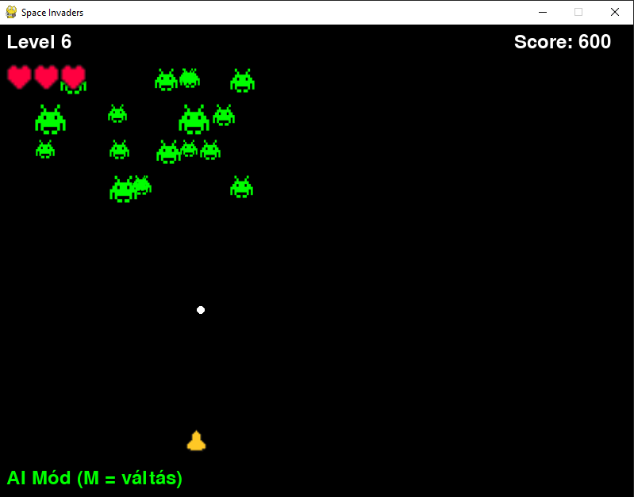

# Space Invaders – Pygame + Hybrid/ML AI

A modern Space Invaders-style game using [Pygame](https://www.pygame.org/news), ⭐ power-ups and two AI modes: **Hybrid** (rules + ML) and **Pure ML** (KNN trained from your own gameplay).

---

## 🕹️ Gameplay

- **Move (manual):** ← / →  
- **Shoot:** Space  
- **Toggle AI on/off:** `M`  
- **Menu:** ↑ / ↓ to navigate, **Enter** to select, **Esc** to quit  
- **Power-up:** ⭐ appears randomly; picking or hitting it grants rapid fire for a few seconds  
- **Lose a life:** on collision **or** when an enemy breaches the player's row  
- **Game Over:** when lives reach 0  
- **Difficulty:** Easy / Normal / Hard (in the main menu)

---

## 🛠️ Installation & Running

### Requirements
- Python 3.10+
- [Pygame](https://www.pygame.org/news)
- scikit-learn (`sklearn`) + joblib

Install:
```bash
pip install pygame scikit-learn joblib
```

> On Windows, consider a venv:  
> `python -m venv .venv && .venv\Scripts\activate`

### Run the game
```bash
python main.py
```

---

## 🧠 Train the Player AI (KNN)

During **manual play** (AI off), the game logs examples to `examples.csv` when you press:
- ←  →  (actions 0 / 1)
- Space (action 2)

Columns: `dx, dy, action, speed_multiplier, enemy_count`  
(The trainer uses `dx, dy, action`.)

Train and save the model:
```bash
# Option A: module
python -m train.player.ai

# Option B: direct path
python train/player/ai.py
```

Output:
- Prints test accuracy and sample count
- Saves `player_model.joblib` (auto-loaded by `main.py`)

---

## 🤖 AI Modes & Benchmark

- **Hybrid:**  
  1) ⭐ priority (align horizontally, shoot when centered & off cooldown)  
  2) Enemy aiming: first align horizontally (tight tolerance for small enemies), then shoot  
  3) Respects shooting cooldown and falls back to rule-based logic if needed

- **Pure ML:**  
  Uses the KNN prediction (0=left, 1=right, 2=shoot), with basic cooldown checks.

### 3–3 minute comparison (Hybrid vs ML)
Built-in measurement alternates **Hybrid** and **ML** in 3-minute blocks. **Each switch fully resets** to a clean start at level 1. At the end of a block—or earlier if you lose—**the console prints** the score for that mode and the running summary, e.g.:
```
=== 3 perces blokk vége ===
Mód:  HYBRID  | Score:  1860  | Lives:  2
Összesített eredmények: {'hybrid': 1860, 'ml': 1880}
```

---

## 📂 CSV Management & Advanced Analytics

The project includes comprehensive CSV management and analytics tools for tracking player performance and generating detailed statistics.

### Core CSV Functions (csv_helper)

- **`load_and_clean(path: str) -> pd.DataFrame`**  
  Loads and cleans a CSV. Required columns: player, score. Raises FileNotFoundError, ValueError.

- **`best_per_player(df: pd.DataFrame) -> pd.DataFrame`**  
  Picks each player's best score, sorts descending and adds a rank column.

- **`merge_scoreboards(pattern: str = "assets/csv/scoreboard_day*.csv") -> Optional[pd.DataFrame]`**  
  Glob-loads daily files, concatenates them, applies best_per_player, and saves CSV/HTML. Returns None if no matches.

- **`add_tiers(df: pd.DataFrame) -> pd.DataFrame`**  
  Adds a 'tier' column (default: Bronze/Silver/Gold ranges).

- **`season_leaderboard() -> Optional[pd.DataFrame]`**  
  Wrapper: merge → add tiers → save (season_leaderboard.csv/.html) → returns DataFrame.

### Analytics & Statistics Scripts

#### **`run_stats.py`** — Advanced Player Analytics
Comprehensive statistics generator that analyzes player performance, improvement trends, and generates detailed reports.

**Features:**
- **Player Performance Analytics:** Average, median, best scores, and game counts per player
- **Improvement Analysis:** Compares first vs. best performance, tracks player development
- **Tier Classification:** Bronze (0-500), Silver (501-1000), Gold (1000+) based on best scores
- **Top Performance Lists:** Generates Top 5 lists for both improvement and best scores
- **Multi-format Output:** Saves results in both CSV and HTML formats

**Usage:**
```bash
# Prerequisites: Clean data first
python run_load_csv.py

# Generate comprehensive analytics
python run_stats.py
```

**Sample Output:**
```
🎮 SPACE INVADERS STATISZTIKÁK
📊 Tisztított CSV adatok:
   - Összes játék: 17
   - Játékosok száma: 7
   - Legmagasabb pontszám: 1690

👥 JÁTÉKOSONKÉNTI STATISZTIKÁK:
jatekos  atlag  median  legjobb  jatekok_szama
    Mór  595.7   610.0     1690              7
 Player  340.0   315.0      510              4

Szintek pontszám alapján:
   Bronz: 5 játékos
   Ezüst: 1 játékos  
   Arany: 1 játékos

📈 JAVULÁSI ÖSSZEFOGLALÓ:
   - Javulást elért: 3 játékos (42.9%)
   - Átlagos javulás: 659.3 pont
   - Legnagyobb javulás: Mór (1590 pont)

Mentve: assets/csv/top_javulas.csv, assets/html/top_javulas.html
```

**Generated Files:**
- `assets/csv/top_javulas.csv` — Top 5 player improvements (CSV)
- `assets/csv/top_legjobb.csv` — Top 5 best scores (CSV)
- `assets/html/top_javulas.html` — Top 5 improvements (HTML table)
- `assets/html/top_legjobb.html` — Top 5 best scores (HTML table)

#### Other CSV Management Scripts

- **`run_load_csv.py`** — load & clean (saves: scoreboard_clean.csv)
- **`run_best.py`** — process single file, Top N and save (leaderboard_best.csv/.html)
- **`run_merge.py`** — merge daily files (leaderboard_merged_best.csv/.html)
- **`run_season.py`** — full season leaderboard (season_leaderboard.csv/.html)

### Example (imported)

```python
from csv_helper import load_and_clean, best_per_player, merge_scoreboards

df = load_and_clean("assets/csv/scoreboard.csv")
best = best_per_player(df)
merged = merge_scoreboards("assets/csv/scoreboard_day*.csv")
```

### Analytics Integration with JSON
The analytics system integrates with `highscore.json` to compare historical performance:
- Uses JSON data as baseline when available
- Falls back to CSV best scores for missing players
- Calculates improvement from first recorded game to best performance

### Tips

- Ensure CSVs include 'player' and 'score' columns
- Run `run_load_csv.py` before analytics to clean data
- HTML files can be opened in browsers for formatted viewing
- For large-scale processing enable logging and consider chunking

---

## 📷 Screenshot



---

## 📄 License

This project is intended for learning purposes.

---

# Space Invaders – Pygame + Hibrid/ML AI (Magyar)

Modern **Space Invaders**-jellegű játék [Pygame](https://www.pygame.org/news)-gel, ⭐ power-uppal és két AI-móddal: **Hibrid** (szabályok + ML) és **Tiszta ML** (KNN a saját játékmintáidból).

---

## 🕹️ Játékmenet

- **Mozgás (manuális):** bal/jobb nyíl  
- **Lövés:** Space  
- **AI mód váltása:** `M`  
- **Menü:** fel/le nyíl, **Enter** választ, **Esc** kilép  
- **Power-up:** ⭐ – rövid ideig gyorslövés  
- **Életvesztés:** ütközéskor **vagy** ha az ellenség eléri a játékos sorát  
- **Game Over:** ha elfogynak az életek  
- **Nehézség:** Könnyű / Normál / Nehéz

---

## 🛠️ Telepítés és futtatás

### Követelmények
- Python 3.10+
- Pygame
- scikit-learn + joblib

Telepítés:
```bash
pip install pygame scikit-learn joblib
```

> Windows-on érdemes virtuális környezetet használni:  
> `python -m venv .venv && .venv\Scripts\activate`

### A játék futtatása
```bash
python main.py
```

---

## 🧠 AI tanítás (KNN)

**Manuális** módban a játék **naplózza** a példákat: `examples.csv` (←=0, →=1, Space=2).  
Oszlopok: `dx, dy, action, speed_multiplier, enemy_count`.

Tréning:
```bash
# Opció A: modul
python -m train.player.ai

# Opció B: közvetlen útvonal
python train/player/ai.py
```

Eredmény: teszt pontosság, mintaszám, mentett `player_model.joblib` (futáskor automatikusan betöltődik).

---

## 🤖 AI módok & mérés

- **Hibrid:** ⭐ prioritás, vízszintes igazítás kicsi ellenségekre is pontosabban, csak utána lövés; cooldown figyelembevétele; szükség esetén szabály-alapú fallback.
- **Tiszta ML:** KNN (0=balra, 1=jobbra, 2=lő) alapú döntés, minimális szabályozással.

### 3–3 perces összehasonlítás
A beépített mérőmód 3 perc **Hibrid**, majd 3 perc **ML** blokkot futtat, **mindkét váltásnál teljes újraindítással**. A blokk végén (vagy korai Game Overnél) **konzolra kiírja** az eredményt és az összesítést, pl.:
```
=== 3 perces blokk vége ===
Mód:  HYBRID  | Score:  1860  | Lives:  2
Összesített eredmények: {'hybrid': 1860, 'ml': 1880}
```

---

## 📂 CSV kezelés és fejlett analitika

A projekt átfogó CSV kezelést és analitikai eszközöket tartalmaz a játékos teljesítmény követéséhez és részletes statisztikák generálásához.

### Alap CSV funkciók (csv_helper)

- **`load_and_clean(path: str) -> pd.DataFrame`**  
  CSV betöltés és tisztítás. Szükséges oszlopok: player, score. FileNotFoundError, ValueError kivételeket dobhat.

- **`best_per_player(df: pd.DataFrame) -> pd.DataFrame`**  
  Minden játékos legjobb pontszámát kiválasztja, csökkenő sorrendbe rendezi és rang oszlopot ad hozzá.

- **`merge_scoreboards(pattern: str = "assets/csv/scoreboard_day*.csv") -> Optional[pd.DataFrame]`**  
  Napi fájlokat glob-load-dal betölt, összefűzi, best_per_player-t alkalmaz, és CSV/HTML-t ment. None-t ad vissza, ha nincs egyezés.

- **`add_tiers(df: pd.DataFrame) -> pd.DataFrame`**  
  'tier' oszlopot ad hozzá (alapértelmezett: Bronz/Ezüst/Arany tartományok).

- **`season_leaderboard() -> Optional[pd.DataFrame]`**  
  Wrapper: merge → tiers hozzáadása → mentés (season_leaderboard.csv/.html) → DataFrame visszaadás.

### Analitikai és statisztikai szkriptek

#### **`run_stats.py`** — Fejlett játékos analitika
Átfogó statisztikagenerátor, amely elemzi a játékos teljesítményét, javulási trendeket és szint besorolást végez.

**Funkciók:**
- Játékos teljesítmény analitika (átlag, medián, legjobb pontszámok, játékszám)
- Javulási elemzés első és legjobb teljesítmény összehasonlításával
- Szint besorolás: Bronz (0-500), Ezüst (501-1000), Arany (1000+)
- Top 5 listák javulás és legjobb pontszámok alapján
- CSV és HTML kimeneti formátumok
- JSON integráció történelmi alapérték összehasonlításhoz

**Használat:**
```bash
# Előfeltétel: Először tisztítsd az adatokat
python run_load_csv.py

# Analitika generálása
python run_stats.py
```

**Generált fájlok:**
- `assets/csv/top_javulas.csv` — Top 5 játékos javulás
- `assets/csv/top_legjobb.csv` — Top 5 legjobb pontszámok
- `assets/html/top_javulas.html` — Top 5 javulások (HTML)
- `assets/html/top_legjobb.html` — Top 5 legjobb pontszámok (HTML)

#### Egyéb CSV kezelő szkriptek

- **`run_load_csv.py`** — betöltés és tisztítás (menti: scoreboard_clean.csv)
- **`run_best.py`** — egy fájl feldolgozása, Top N és mentés (leaderboard_best.csv/.html)
- **`run_merge.py`** — napi fájlok összefűzése (leaderboard_merged_best.csv/.html)
- **`run_season.py`** — teljes szezon ranglista (season_leaderboard.csv/.html)

### Példa (importálva)

```python
from csv_helper import load_and_clean, best_per_player, merge_scoreboards

df = load_and_clean("assets/csv/scoreboard.csv")
best = best_per_player(df)
merged = merge_scoreboards("assets/csv/scoreboard_day*.csv")
```

### Analitika integrációja JSON-nal
Az analitikai rendszer integrálódik a `highscore.json`-nal a történelmi teljesítmény összehasonlításához:
- JSON adatokat használ alapértékként, ha elérhető
- A hiányzó játékosokhoz a CSV legjobb pontszámokat használja
- Kiszámolja a javulást az első rögzített játéktól a legjobb teljesítményig

### Tippek

- Győződj meg róla, hogy a CSV-k tartalmazzák a 'player' és 'score' oszlopokat
- Az analitika előtt futtasd a `run_load_csv.py`-t az adatok tisztításához
- A HTML fájlokat böngészőkben lehet megnyitni formázott megjelenítéshez
- Nagy méretű feldolgozáshoz engedélyezd a naplózást és fontold meg a darabokra bontást

---

## 📷 Képernyőkép


---

## 📄 Licenc

Ez a projekt tanulási célokra készült.

---

**Jó játékot! 🚀**
